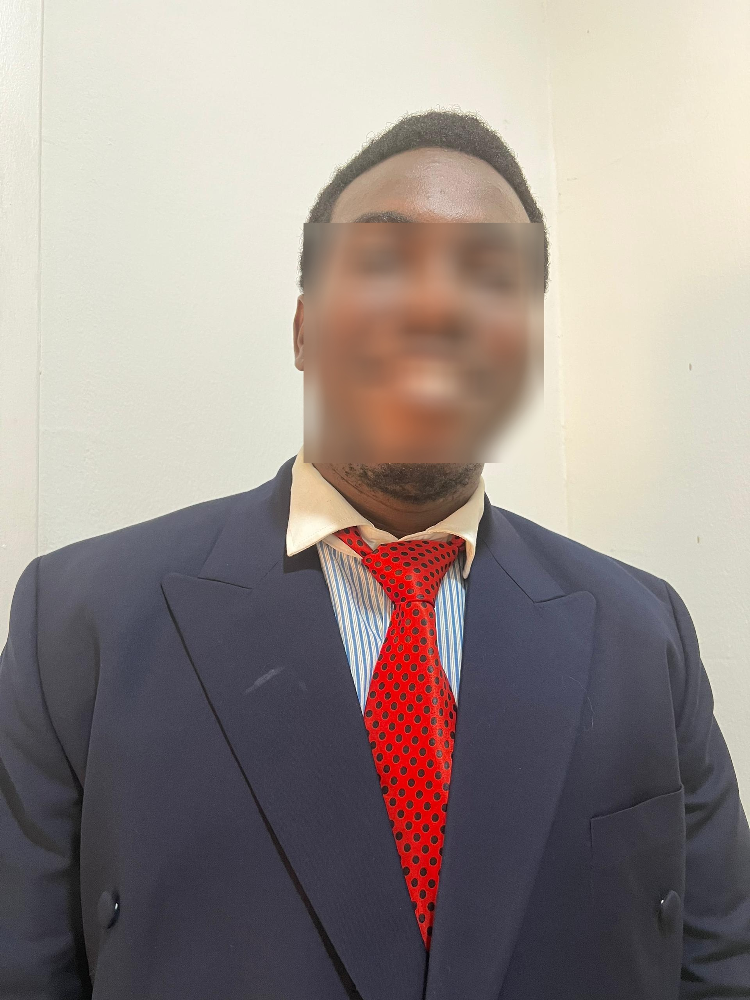

# Face Detector Anonymizer

This project is a face anonymization tool that uses MediaPipe's Face Detection API to detect faces and apply blurring for privacy. It supports processing images, videos, and webcam streams. The output includes anonymized results saved in a designated folder.

## Features
- Detects faces using MediaPipe's Face Detection API.
- Blurs detected faces for privacy.
- Supports three modes:
  - **Image**: Anonymizes faces in static images.
  - **Video**: Anonymizes faces in video files.
  - **Webcam**: Real-time face anonymization using a webcam.

## Requirements
To run this project, ensure you have the following:

- Python 3.x
- OpenCV library
- MediaPipe library

### Installing Requirements
Install the required Python packages using the command:

```bash
pip install -r requirements.txt
```

The `requirements.txt` file contains:
```
opencv-python
mediapipe
```

## Project Structure
```
.
|-- blurimg.py           # Anonymizes faces in static images
|-- blurvideo.py         # Anonymizes faces in video files
|-- blurwebcam.py        # Real-time face anonymization using a webcam
|-- img1.jpg             # Sample input image for testing
|-- output               # Directory containing anonymized results
|-- requirements.txt     # Required Python packages
```

## Usage
### 1. Anonymize Faces in Images
Run the `blurimg.py` script to process an image:
```bash
python blurimg.py --mode image --filepath path/to/image.jpg
```
#### Output:
- The anonymized image is saved in the `output` directory as `blurred_img.jpg`.

### 2. Anonymize Faces in Videos
Run the `blurvideo.py` script to process a video:
```bash
python blurvideo.py --mode video --filepath path/to/video.mp4
```
#### Output:
- The anonymized video is saved in the `output` directory as `blurred_video.mp4`.

### 3. Real-Time Webcam Anonymization
Run the `blurwebcam.py` script to process webcam input:
```bash
python blurwebcam.py --mode webcam
```
#### Key Features:
- Press `q` to quit the webcam feed.
- An anonymized video is saved in the `output` directory as `blurred_video.mp4`.

## Results
### 1. Image Results
Below is an example of an anonymized image processed using the tool:


### 2. Webcam Results
A snapshot of a real-time webcam feed with anonymization:


## Credits
- OpenCV: [https://opencv.org](https://opencv.org)
- MediaPipe: [https://mediapipe.dev](https://mediapipe.dev)
- computer vision engineer: [https://youtube.com/@ComputerVisionEngineer](https://youtu.be/DRMBqhrfxXg?si=v7Pmlyggcx1XJgGZ)

## License
This project is licensed under the MIT License - see the LICENSE file for details.

